

  
# Open Your Heart - Save the Planet - Meditation App

Get out of your headspace and live in your mindspace.
 

### Save the Earth

Software won't save the earth.. but you will.. If everyone opened their heart, the earth would be a much nicer place to live. Use our app to tune into live zoom calls daily.. An app based on my meditation community.. ([naturalwayofliving.com](naturalwayofliving.com)) as a volunteer, I spent the earlier part of COVID 19 building out a public google calendar of free meditation resources for any background.. i have been wanting to build an app to make it more accessible than this google cal.. (see YT desc for Google Calender)

### YouTube video link
[Let us show you our video](https://www.youtube.com/watch?v=N_P1iXVjLhw)
 
### Here are some screenshots of the app

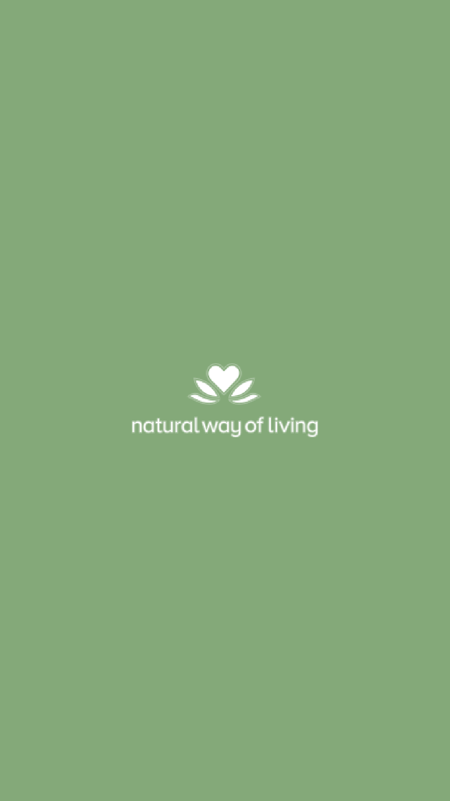
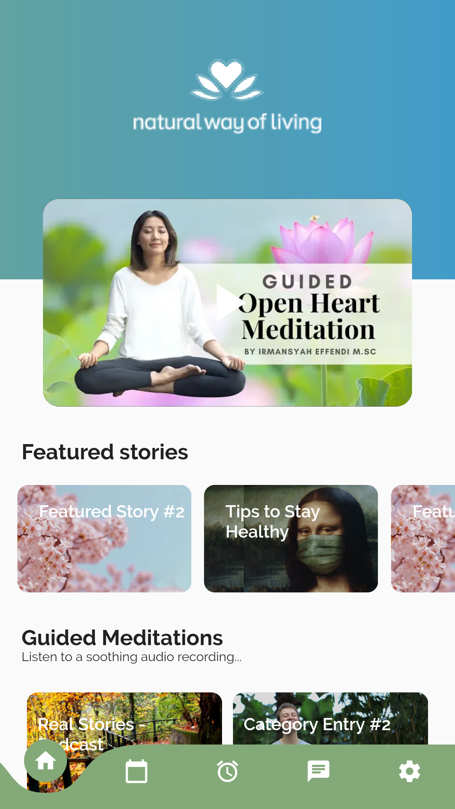
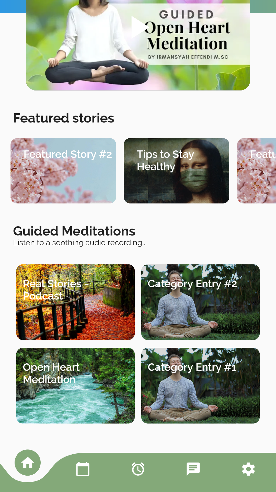
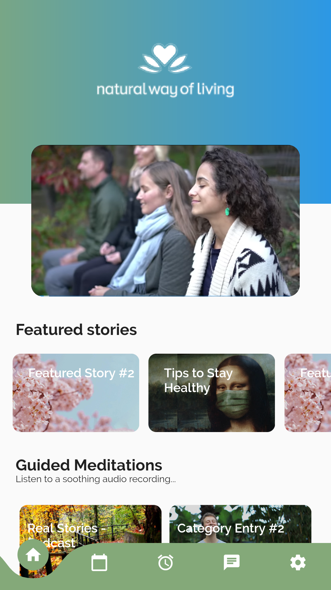
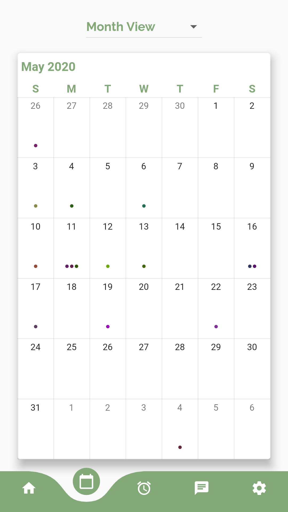
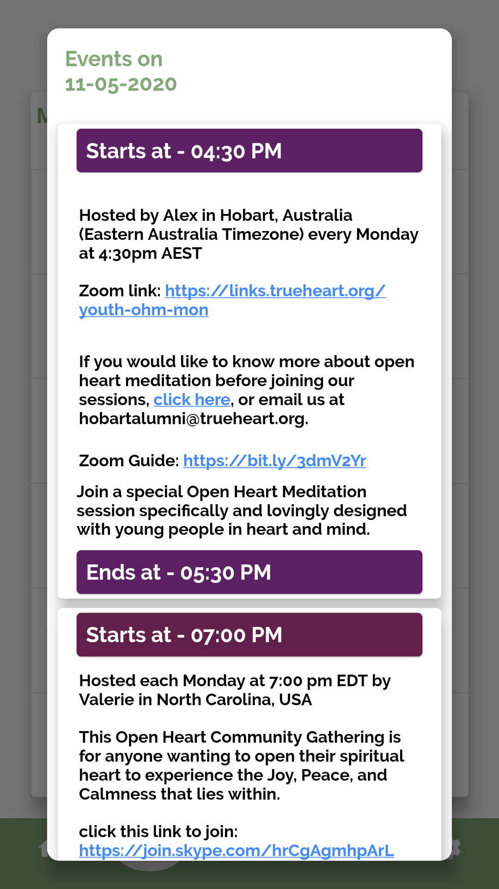
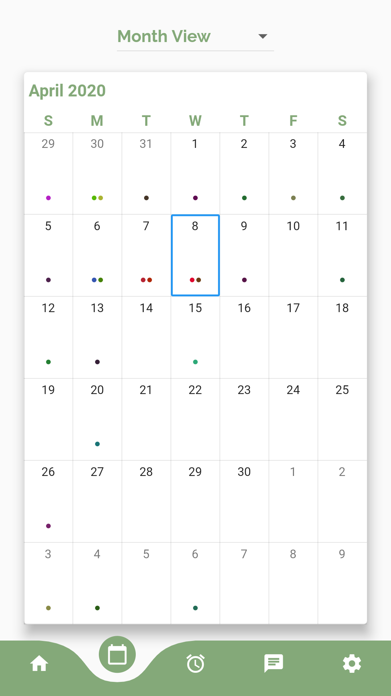
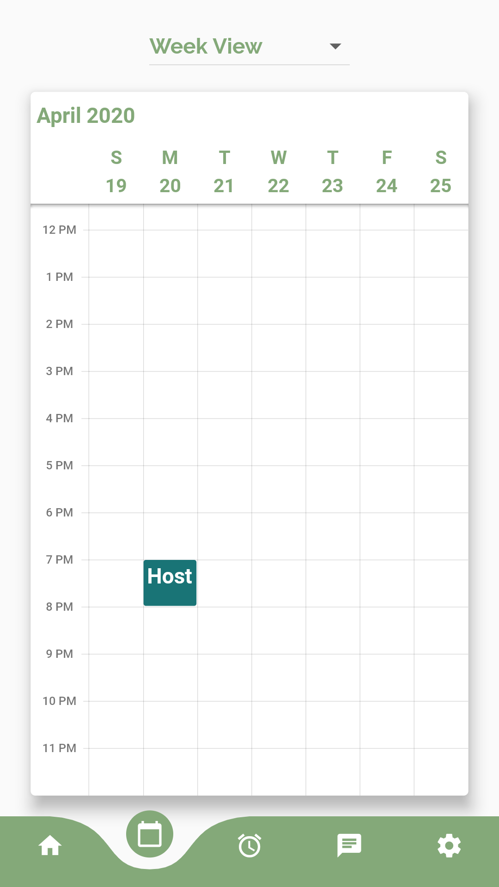
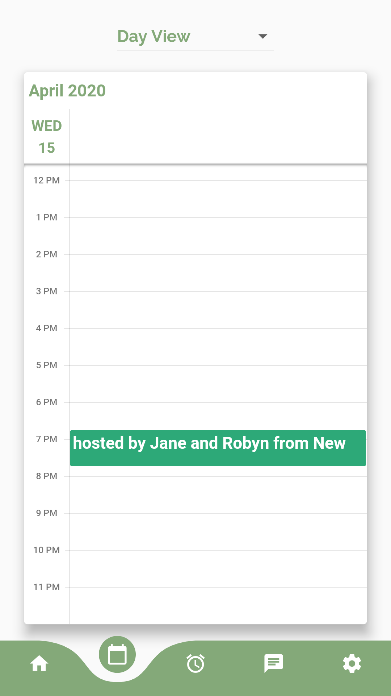
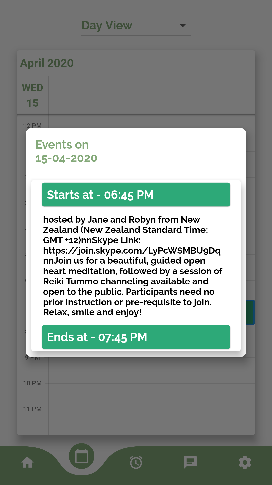
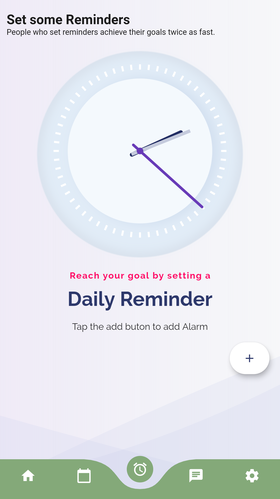
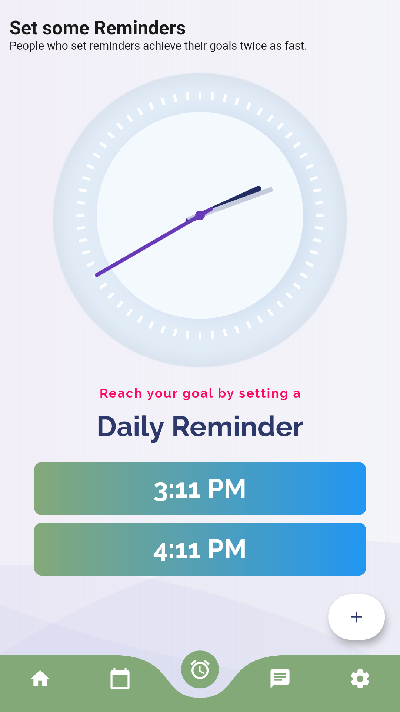
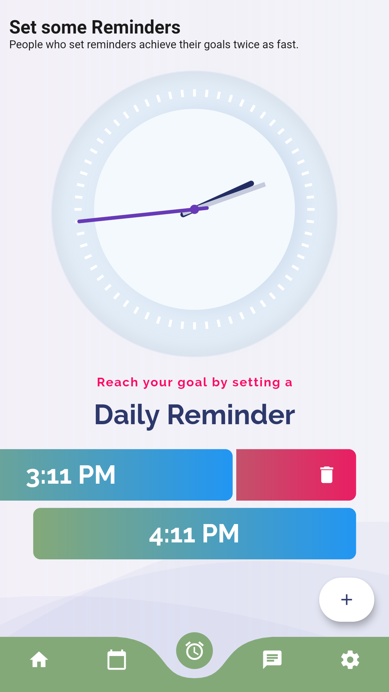
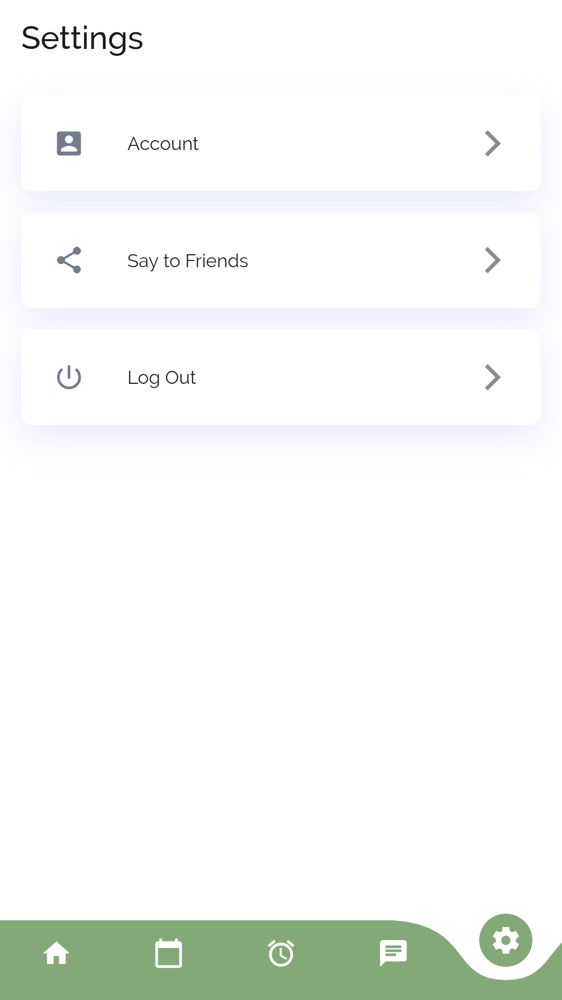
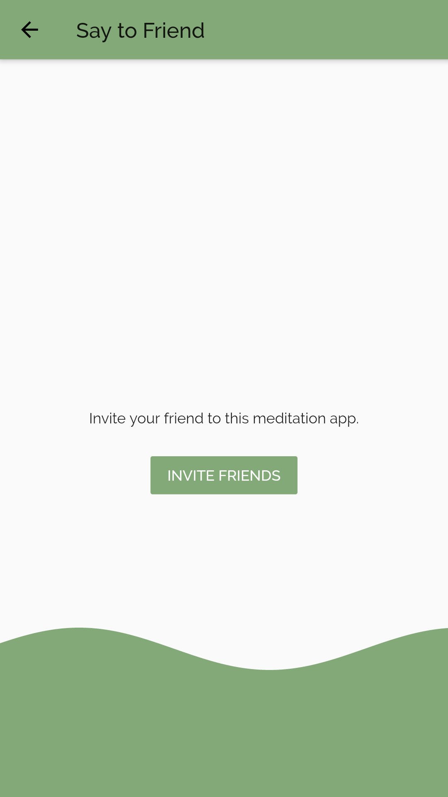

### You download the app from here

## Hack20

Thanks to Flutter Community for organizing such a wonderful event which made us to collaborate with other and feel like a family❤❤
